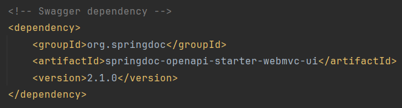
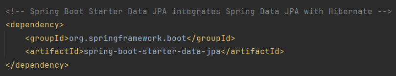
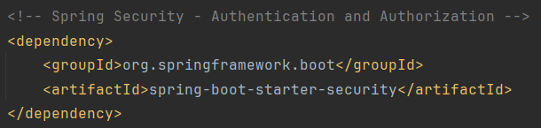

# CodeMelodies
### *CodeMelodies* to elegancka i intuicyjna platforma, stworzona z myślą o rozpowszechnianiu treści związanych z muzyką poważną z okresu baroku i klasycyzmu. Aplikacja ma na celu propagowanie treści przeznaczonych dla pewnej grupy odbiorców. Projekt kładzie nacisk na intuicyjność oraz zwięzłość treści.

### Funkcje

Aplikacja *CodeMelodies* oferuje następujące funkcje: 
- 🎵 Galeria Nagrań:
 > Eksploruj bogatą kolekcję nagrań, prezentującą wyjątkowe interpretacje utworów.
- 📘 Publikacje:
 > Zapoznaj się z artykułami dotyczącymi różnych aspektów muzyki poważnej, technik gry na flecie i wiele więcej.
- 👥 Profil Artysty:
 > Poznaj artystkę bliżej, zapoznając się z jej biografią, osiągnięciami i dokumentacją artystyczną w postaci nagrań i zdjęć.
- 📅 Kalendarz Wydarzeń
 > Bądź na bieżąco z nadchodzącymi koncertami, wydarzeniami i premierami nagrań.
- 💌 Kontakt:
 > Skontaktuj się bezpośrednio z artystką, zadając pytania lub wyrażając swoje uwagi.

## Struktura projektu

### Wybrane frameworki:
**Frontend**: _Angular CLI_:

```bash ng new CodeMelodies --routing --skip-git --skip-tests --style css```

- ``` ng new CodeMelodies``` - tworzy nowy projekt z zadanymi parametrami:

- ``` --routing ``` - dodaje moduł routingu do nowoutworzonego projektu
- ``` --skip git ``` -  pomija inicjalizację repozytorium Git dla nowego projektu
- ``` --skip-tests ``` -   pomija generowanie plików specyfikacji testów dla nowego projektu
- ``` --style css ``` -  definiuje technologię stylowania, która ma być używana w projekcie

 Wykorzystano też bibliotekę arkusza styli CSS - _Bootstrap_.

**Backend**: _Spring Framework_. Aplikację Springową utworzono przy pomocy **Spring Initializr**.

#### Uzasadnienie doboru architektury:

Decyzja o wyborze Angulara, Bootstrapa i Springa jako podstawowych technologii dla projektu została podjęta z kilku kluczowych powodów. Przede wszystkim, każdy z tych frameworków posiada silną i stabilną pozycję na rynku, co jest kluczowe dla zapewnienia długoterminowego wsparcia i aktualizacji. Angular CLI jest szczególnie ceniony wśród deweloperów za jego modularność, efektywność i integrację z TypeScript. Z kolei Bootstrap, jako biblioteka CSS, jest powszechnie uznawany za standard w projektowaniu responsywnych i estetycznie atrakcyjnych interfejsów użytkownika. Dzięki gotowym komponentom, Bootstrap pozwala na szybkie tworzenie spójnych i funkcjonalnych interfejsów.
 
Spring Framework jest jednym z najbardziej kompleksowych rozwiązań dla aplikacji back-endowych w Javie. Oferuje on szerokie możliwości w zakresie tworzenia bezpiecznych, wydajnych i skalowalnych aplikacji serwerowych. Jego adaptacyjność i wsparcie dla różnorodnych architektur sprawiają, że jest on idealnym wyborem dla nowoczesnych aplikacji. 
 
Kluczową jednak rolę w doborze architektury stanowią osobiste zainteresowania autorki projektu.

### Endpointy API

#### Użycie API przez aplikację kliencką

**register-controller**
- `POST`
	- `/api/register`

**login-controller**
- `POST`
	- `/api/login/wyloguj`
- `GET`
	- `/api/login/zaloguj`

**obrazy-controller**
- `GET`
	- `/api/zdjecie/{uuid}`
- `GET`
	- `/api/zdjecia/ids`
- `GET`
	- `/api/ikona/{uuid}`

**you-tube-controller**
- `GET`
	- `/api/youtube`

**kontakt-controller**
- `GET`
	- `/api/wydarzenia`
- `GET`
	- `/api/socialmedia`

**publikacje-controller**
- `GET`
	- `/api/publikacje`
- `GET`
	- `/api/publikacja/{uuid}`

**o-mnie-controller**
- `GET`
	- `/api/omnie`

#### Dokumentacja SWAGGER: 

Zależność _springdoc-openapi-starter-webmvc-ui_ jest elementem integracji dokumentacji API z aplikacjami Spring Boot. Ta zależność, będąca częścią biblioteki _SpringDoc_, automatycznie generuje dokumentację API zgodną ze specyfikacją OpenAPI 3 na podstawie kodu źródłowego aplikacji. W szczególności analizuje kontrolery Springa, ich metody, parametry i modele danych, tworząc z nich dokładny opis API. Dodatkowo dostarcza interfejs użytkownika Swagger UI, który umożliwia testowanie dokumentacji API bezpośrednio z przeglądarki. 

Test enpointów możliwy jest pod adresem: http://localhost:8080/swagger-ui/index.html#/:


### Rest API/GRAPH QL
W przypadku tego projektu do komunikacji warstwy Frontendu z Backendem wykorzystano Rest API. Do testowania Rest API wykorzystano Swagger UI.

### Baza danych
#### ERD:

#### Złożoność bazy danych:

Baza danych zawiera wszystkie typy relacji:
- jeden-do-jednego
- jeden-do-wielu
- wiele-do-wielu

#### ORM/JPA/ODM
Jako narzędzie ORM (_Object-Relational Mapping_), wykorzystano _Hibernate_. W połączeniu z bazą danych PostgreSQL, stanowi on solidne i wydajne rozwiązanie dla zarządzania warstwą danych. _Hibernate_ ułatwia mapowanie obiektów Java na tabele w bazie danych PostgreSQL, co pozwala na intuicyjne i obiektowe zarządzanie danymi. Dzięki _Hibernate_, złożoność operacji na bazie danych jest ukryta za prostszym interfejsem, co przekłada się na większą czytelność i łatwość utrzymania kodu.

_Dependency_ odpowiedzialne za dodanie _Hibernate_'a:


#### Kopia bazy danych:

### GIT
Projekt wykorzystuje system kontroli wersji GIT hostowany przez platformę _GitHub_: `https://github.com/WiolaWysopal/CodeMelodies.git`

### Autoryzacja użytkownika

W projekcie wykorzystano mechanizm _Basic Autentication_, który realizuje poniższa dependencja:

Zależność _spring-boot-starter-security_ jest zależnością Spring Boot, która umożliwia łatwą integrację i konfigurację _Spring Security_ w aplikacji. _Spring Security_ zapewnia bezpieczeństwo aplikacji poprzez uwierzytelnienie i autoryzację użytkowników. Dzięki tej zależności możliwa jest implementacja bezpiecznego logowania i zarządzanie dostępem do różnych części aplikacji. _Spring Security_ wspiera szeroki zakres opcji uwierzytelniania, w tym logowanie oparte na formularzach, uwierzytelnianie za pomocą _OAuth2_ oraz _HTTP Basic Authentication_. Umożliwia również definiowanie reguł dotyczących dostępu do zasobów aplikacji, co pozwala na precyzyjne kontrolowanie, który użytkownik ma dostęp do określonych funkcji lub danych w aplikacji.